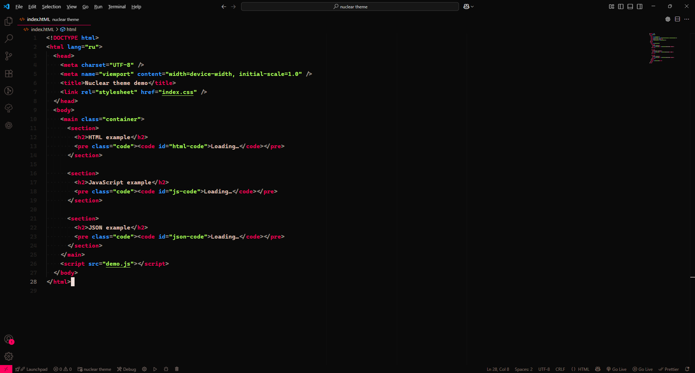
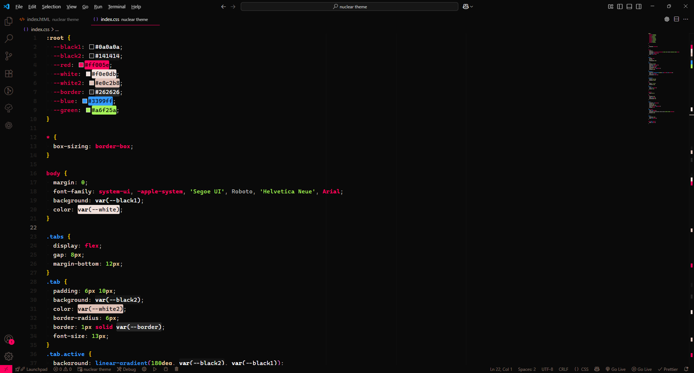
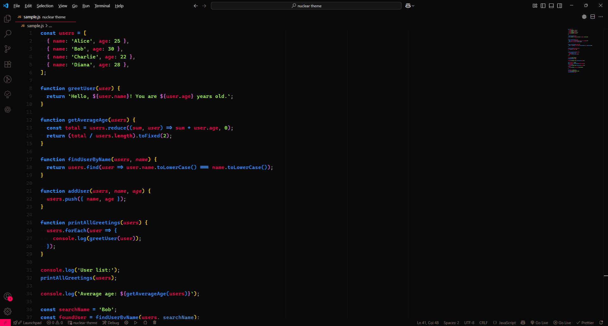

# Nuclear Hippie — VS Code Theme

A handcrafted, high-contrast VS Code color theme with vibrant accents inspired by retro synth palettes. Clean, readable colors for editors, terminals, and UI elements aimed at comfortable long coding sessions.

## Quick overview

- Name: Nuclear Hippie
- Type: Color theme (UI + Workbench + Syntax)
- Files: `themes/Nuclear-hippie-theme.json`

## Preview

Below are screenshots from the `screenshots/` folder showing the theme applied to different file types.

### C++


### HTML


### CSS


### JavaScript


> Note: If any image doesn't render on your platform, open the `screenshots/` folder and view the PNG files directly.

## Installation

Choose one of the methods below depending on how you prefer to install the theme.

### 1) Install from VSIX (recommended for this repo)

If you have the packaged extension file in the project root (`nuclear-hippie-0.1.0.vsix`), install it with VS Code or the command line.

- From VS Code UI:
  1. Open VS Code.
  2. Open the Extensions view (Ctrl+Shift+X).
  3. Click the ellipsis (⋯) menu in the Extensions view and choose "Install from VSIX...".
  4. Select `nuclear-hippie-0.1.0.vsix` from this repository.

- From the command line (PowerShell):

```powershell
code --install-extension "PATH\nuclear-hippie-0.1.0.vsix"
```

Replace the path above if the `.vsix` file is located elsewhere.

### 2) Install from Marketplace

If the theme is published to the VS Code Marketplace, search for "Nuclear Hippie" in the Extensions view and click Install.

### 3) Developer / Local testing

If you want to test changes locally without packaging:

1. Open this repository in VS Code.
2. Open the Command Palette (Ctrl+Shift+P) and run `Developer: Reload Window` after editing the theme JSON.
3. Open the Command Palette and run `Preferences: Color Theme`, then select "Nuclear Hippie".

If you maintain the extension, use `vsce package` to create a `.vsix` and then install it using the steps above.

## Usage

After installing, switch the active theme:

1. Open the Command Palette (Ctrl+Shift+P).
2. Type `Preferences: Color Theme` and press Enter.
3. Choose "Nuclear Hippie" from the list.

## Contribution

Contributions are welcome. Small suggestions:

- Open an issue describing the change or color adjustment.
- Submit a pull request modifying `themes/Nuclear-hippie-theme.json`.

When making color changes, include before/after screenshots and a short rationale for the palette choice.

## License & Credits

This project doesn't include a license file in the repo. If you want to make the theme open source, consider adding an OSI-approved license such as MIT or Apache-2.0. Add `LICENSE` to the repo and update `package.json` accordingly.

Credits: Theme created by the repository author.

---

## Requirements coverage

Checklist of user requirements from the request:

- Create a nice `README.md` for the project — Done.
- Describe what the project is and how it looks — Done (overview + preview).
- Add screenshots from the `screenshots/` folder — Done (CSS, HTML, JS, C++).
- Add a guide how to install the theme — Done (VSIX, Marketplace, dev testing, CLI).

If you'd like, I can also:

- Add a small `CHANGELOG.md` and `LICENSE`.
- Update `package.json` with author/contact and homepage links.

If you want any wording changes or additional sections (badges, live demo, license text), tell me which and I'll update the README.
